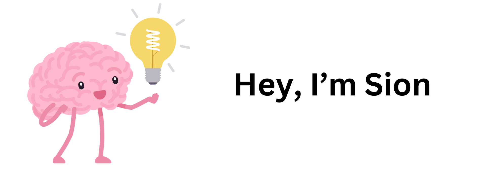

 
 
 
## I am a Full-Stack Developer from Toronto

**Some of my works include**
- [Online Rock-Paper-Scissor Game with real-time chat](https://capstone-game-ui.vercel.app/)
- [Hackathon web Game](https://sionara.github.io/GGJ/)
- Bookstore website built with PUG and Node.js

Check out my Github to see some of the pages I am working on!

- 🌱 I am looking for **Internships in Web Development**
- 🔭 I am currently working on a real-time online rock-paper-scissors game! Feel free to check it out and let me know what you think!
- 🎵 Fun fact about me: I love to listen to music

📫 How to reach me:
- Email: sionlee29@gmail.com
- [My linkedin](https://www.linkedin.com/in/sion-lee-lnkdin/)

### :hammer_and_wrench: Languages and Tools :

